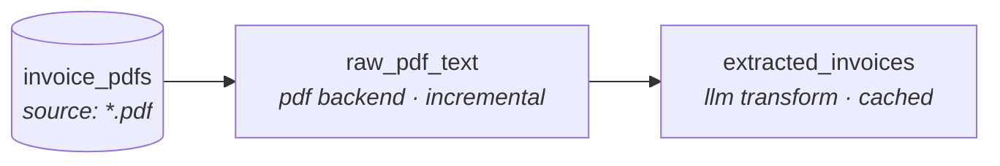

# docbt

**dbt for unstructured data.** docbt brings the dbt workflow — declarative
models, a dependency DAG, `ref()`, tests, incremental builds, lineage, and a
manifest artifact — to folders of documents: PDFs, markdown, HTML, JSON,
email, and free-form text.

If you know dbt, you already know docbt. You declare sources and models in
YAML; docbt builds the DAG, runs it incrementally, materializes the results to
your warehouse, runs your tests, and emits artifacts other tools can consume.

> **Status: working proof of concept.** Pure Python, DuckDB warehouse today.
> The warehouse adapter pattern (v0.2.1, merged) opens the path to the
> dbt-core adapter set — LanceDB, Postgres, Snowflake, BigQuery, Databricks,
> Redshift. See [`docbt/README.md`](docbt/README.md) for the full reference.

## What a pipeline looks like

A project that turns a folder of invoice PDFs into a structured, queryable
table — extract the text with `pypdf`, then use an LLM to pull typed fields:



Each node is a model declared in YAML. The source globs a folder; `raw_pdf_text`
extracts text per document; `extracted_invoices` calls Claude to turn that text
into typed columns — and caches the result so re-runs are free.

### The source

```yaml
# sources/invoices.yml
version: 2
sources:
  - name: invoice_pdfs
    path: "./data/invoices_pdf/"
    file_pattern: "*.pdf"
```

### The extraction model

```yaml
# models/raw_pdf_text.yml
version: 2
models:
  - name: raw_pdf_text
    source: ref('invoice_pdfs')
    extraction:
      backend: pdf
    materialization: incremental      # re-run only reprocesses changed PDFs
    tests:
      - not_null: [text]
      - unique: source_path
```

### The transform model

```yaml
# models/extracted_invoices.yml
version: 2
models:
  - name: extracted_invoices
    depends_on: [ref('raw_pdf_text')]
    transform:
      type: python
      module: transforms.llm_extract  # a Polars function you write
    tests:
      - not_null: [vendor, invoice_id, total]
      - unique: invoice_id
```

### Run it

```bash
uv run docbt init invoices --template pdf   # scaffold a project
# drop your PDFs into ./invoices/data/invoices_pdf/  (or `docbt seed` synthetic ones)
cd invoices
uv run docbt run                            # build the DAG into DuckDB
uv run docbt test                           # run the schema tests
uv run docbt show extracted_invoices        # peek at the result
```

```
model                 kind        mater.         processed   skipped    rows   time(s)
--------------------------------------------------------------------------------------
raw_pdf_text          extraction  incremental            5         0       5     0.31
extracted_invoices    transform   full                   0         0       5     2.10
```

## Why docbt

| | Imperative Python (LlamaIndex) | Managed RAG (Cortex Search, Bedrock KB) | **docbt** |
|---|---|---|---|
| Declarative models + DAG | ✗ | partial | ✓ |
| Tests on extracted data | ✗ | ✗ | ✓ |
| Incremental / cached | DIY | ✓ | ✓ |
| Inspect & swap each stage | ✓ | ✗ | ✓ |
| Lineage / manifest artifact | ✗ | partial | ✓ |
| Reviewable like a dbt PR | ✗ | ✗ | ✓ |
| Composes with existing dbt | ✗ | partial | ✓ |

docbt isn't trying to win on time-to-first-demo (managed services do) or raw
flexibility (LlamaIndex does). It wins on **reproducibility, testability, and
fitting the workflow analytics engineers already use.**

## What's in the box

- **Six extraction backends** — `json`, `markdown`, `pdf`, `html`, `email`,
  and `llm` (Claude tool-use with response caching).
- **Built-in text/ML preprocessing** — token counting, encoding repair,
  language detection, text statistics, near-duplicate detection (MinHash), and
  PII redaction (Microsoft Presidio).
- **dbt-shaped everything** — `ref()`, `--select` / `--exclude` selectors with
  `tag:` support, `not_null` / `unique` / `min_rows` / custom-Python tests with
  warn/error severities, source freshness, profiles with `--target`.
- **Artifacts** — `manifest.json`, `run_results.json`, a static docs site, and
  `emit-dbt-sources` to hand off to a dbt-duckdb project.
- **Composes with dbt** — docbt does the unstructured → structured "E"; dbt
  does the SQL "T", reading docbt's tables as native sources.

## Quickstart

```bash
git clone https://github.com/C00ldudeNoonan/doc-dbt
cd doc-dbt/docbt
uv sync
cd examples/pdf_invoice_pipeline
uv run docbt seed --count 5      # generate synthetic invoice PDFs
uv run docbt run
uv run docbt test
```

Six runnable examples live in [`docbt/examples/`](docbt/examples/) — invoices,
blog posts, support tickets (SLA breach detection), PDF → LLM extraction, and a
dbt-duckdb consumer project.

## Documentation

- **[Full reference](docbt/README.md)** — every backend, command, config block,
  and the roadmap.
- **[Contributing](docbt/CONTRIBUTING.md)** — how to add a backend, test, or
  command.
- **[Changelog](docbt/CHANGELOG.md)**

## License

[MIT](docbt/LICENSE)
